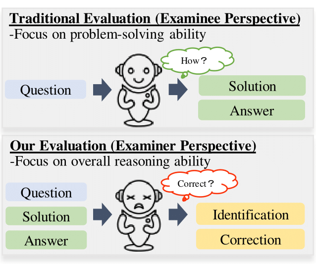

# Evaluating Mathematical Reasoning of Large Language Models: A Focus on Error Identification and Correction

This is the repo for our paper: [Evaluating Mathematical Reasoning of Large Language Models: A Focus on Error Identification and Correction](https://openreview.net/forum?id=IUdJM5HJySV).

## Overview

This repo includes our datasets and codes for generation and evaluation.



- The directory [data](./data/) contains 8 datasets we contributed for  Error Identification and Correction.
- The directory [evaluation](./evaluation/) contains evaluation results for closed-source models (GPT-3.5, GPT-4, GLM-4, Gemini Pro) and open-source models (LLaMA-2-7B, LLaMA-2-13B, MetaMath-7B, MetaMath-13B).
- The directory [code](./code/) contains our generation and evaluation codes.

## Data Release

This directory [data](./data/) contains 8 datasets for Error Identification and Correction. The suffix of the folder name indicates the source of the generated data([GSM8K]([GitHub - openai/grade-school-math](https://github.com/openai/grade-school-math?tab=readme-ov-file)) or [MathQA]([MathQA-Dataset (math-qa.github.io)](https://math-qa.github.io/math-QA/))).

To be specific: 

- [generated_cases_GSM8K](./data/generated_cases_GSM8K/): cases of nine error types generated from GSM8K by GPT-4.
- [generated_cases_MathQA](./data/generated_cases_MathQA/): cases of nine error types generated from MathQA by GPT-4.
- [EP_robustness_testing_cases_GSM8K](./data/EP_robustness_testing_cases_GSM8K/): cases of nine error types for EP robustness testing from GSM8K containing 50 correct cases and 50 incorrect cases.
- [EP_robustness_testing_cases_MathQA](./data/EP_robustness_testing_cases_MathQA/): cases of nine error types for EP robustness testing from MathQA.
- [incomplete_generated_cases_GSM8K](./data/incomplete_generated_cases_GSM8K/): cases of incomplete generated cases from GSM8K.
- [incomplete_generated_cases_MathQA](./data/incomplete_generated_cases_MathQA/): cases of incomplete generated cases from MathQA.
- [step_number_cases_GSM8K](./data/step_number_cases_GSM8K/): cases for specific step numbers of solution from GSM8K.
- [step_number_cases_MathQA](./data/step_number_cases_MathQA/): cases for specific step numbers of solution from MathQA.

Each data is a `dict`, and the keys are:

- `question`: problem.
- `original_solution`: correct solution.
- `original_answer`: correct answer.
- `transformed_solution`: incorrect solution after transformation.
- `transformed_answer`: incorrect answer after transformation.
- `wrong_step`: first wrong step occurring in transformed_solution.
- `wrong_type`: wrong type of transformed_solution.
- `is_single_error`: boolean type of whether wrong_type is single.
- `explanation`: explanation of how transformed_solution is transformed from original_solution.

## Data Generation & Evaluation Process 

This directory [code](./code/) contains all generation and evaluation codes.

**generate**: 

- [`generate.py`](./code/generation/generate.py): Use this to generate error cases([generated_cases_GSM8K](./data/generated_cases_GSM8K/)). 
  For example:

  ```bash
  python generate.py --model_name gpt-3.5-turbo-1106 --dataset GSM8K --selected_type calculation_error --expected_cases 100
  ```

**evaluate**: 

- [`evaluate.py`](./code/evaluation/closed_source_model/evaluate.py): Use this to evaluate the generated error cases for closed-source models. It is similar for open-source models.
  For example:

  ```bash
  python evaluate.py --model_name gpt-3.5-turbo-1106 --dataset GSM8K --selected_type calculation_error --selected_test any  --expected_cases 100
  ```

**parameter description**:

- `model_name`: GPT-3.5, GPT-4, GLM-4 or Gemini Pro.
- `dataset`: GSM8K or MathQA.
- `selected_type`: calculation_error, referencing_context_value_error, referencing_previous_step_value_error, confusing_formula_error, counting_error, missing_step, adding_irrelevant_information, operator_error, and unit_conversion_error, nine error types in total.
- `selected_test`: any, step, type or correction. Besides, the suffix simple is zero-shot, complex is few-shot.
- `expected_cases`: number of cases to be generated or evaluated.


## Evaluation Result

This directory [evaluation](./evaluation/) contains evaluation results for closed-source models and open-source models.
